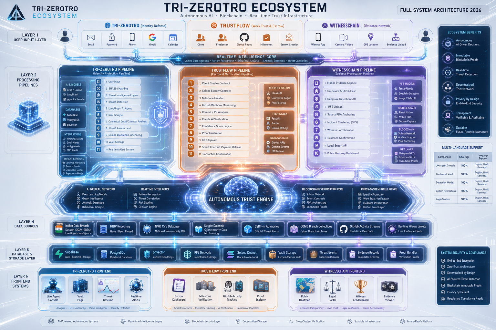

<div align="center">

# ⚡ TRI-ZEROTRO ECOSYSTEM

### *Autonomous Trust & Cybersecurity Ecosystem for 2026*

> **Three Systems. One Intelligence. One Trust Infrastructure.**

---

**TRI-ZEROTRO** is a next-generation AI + Blockchain ecosystem that solves the three most critical trust and cybersecurity crises of 2026 — identity theft, broken remote work trust, and evidence tampering — through three interconnected autonomous platforms powered by a unified AI + Blockchain intelligence core.

</div>

---

## 📋 Table of Contents

- [🌐 The Problem](#-the-problem)
- [🏗️ Ecosystem Overview](#-ecosystem-overview)
- [🔷 PHANTOMID — Identity Defense](#-phantomid--autonomous-ai-identity-defense-platform)
- [🟠 TRUSTFLOW — Work Trust & Escrow](#-trustflow--ai-powered-blockchain-escrow--freelancer-verification)
- [🟣 WITNESSCHAIN — Evidence Network](#-witnesschain--decentralized-civic-evidence-network)
- [🖼️ Full System Architecture](#-full-system-architecture)
- [🛠️ Tech Stack](#-tech-stack)
- [📊 Real Data Sources & Intelligence Pipelines](#-real-data-sources--intelligence-pipelines)
- [🌍 Multi-Language Support](#-multi-language-support)
- [📁 Project Structure](#-project-structure)
- [🚀 Installation & Setup](#-installation--setup)
- [🔐 Security Architecture](#-security-architecture)
- [🗺️ Future Roadmap](#-future-roadmap)
- [👥 Team](#-team)

---

## 🌐 The Problem

The three largest unsolved trust crises of 2026 — affecting billions of users globally.

| # | Problem | Scale | Solved By |
|---|---------|-------|-----------|
| 🔴 | **Identity Theft & Data Breaches** — 18.7M+ identities compromised in India alone (2024–25). Breach detection is reactive, slow, and centralized. | **$10.3B** annual damage | **PHANTOMID** |
| 🟠 | **Broken Trust in Remote Work** — $2.3B+ lost to freelance fraud. No verifiable proof of work, no autonomous escrow, no protection. | **47% of contracts** disputed | **TRUSTFLOW** |
| 🟣 | **Evidence Tampering & Justice Failure** — 75M+ pieces of civic evidence submitted without tamper-proof verification. Courts reject digitally altered media. | **63% cases** dismissed | **WITNESSCHAIN** |

---

## 🏗️ Ecosystem Overview

TRI-ZEROTRO's three platforms share a **unified AI + Blockchain Intelligence Core** — giving each system access to the same powerful infrastructure.

```
╔══════════════════════════════════════════════════════════════╗
║                        USER LAYER                           ║
║          Identity  ·  Work  ·  Civic Evidence               ║
╚══════════════════╦═══════════════════╦═══════════════════════╝
                   ║                   ║                    
     ╔═════════════╩═══════════════════╩═════════════════╗
     ║         REALTIME INTELLIGENCE CORE                ║
     ║   Data Ingestion · Pattern Recognition ·          ║
     ║   Anomaly Detection · Threat Correlation          ║
     ╚═════════════╦═══════════════════╦═════════════════╝
                   ║                   ║
     ┌─────────────┼───────────────────┼──────────────────┐
     ▼             ▼                   ▼                  ▼
 ┌────────┐  ┌──────────┐        ┌──────────┐    ┌──────────┐
 │  AI    │  │ LangGraph│        │  Solana  │    │  IPFS    │
 │ Neural │  │  Agents  │        │Blockchain│    │ Storage  │
 │  Net   │  │          │        │          │    │          │
 └────┬───┘  └────┬─────┘        └────┬─────┘    └────┬─────┘
      │           │                   │               │
      └───────────┴──────────┬────────┴───────────────┘
                             ▼
          ╔═════════════════════════════════╗
          ║    AUTONOMOUS TRUST ENGINE      ║
          ║  AI · Verify · Prove · Protect  ║
          ╚═══════╦══════════╦══════════════╝
                  ║          ║           ║
         ┌────────▼──┐ ┌─────▼────┐ ┌───▼──────────┐
         │ PHANTOMID │ │TRUSTFLOW │ │WITNESSCHAIN  │
         │ Identity  │ │  Escrow  │ │  Evidence    │
         │ Defense   │ │  Trust   │ │  Network     │
         └───────────┘ └──────────┘ └──────────────┘
```

**Shared Infrastructure Across All Three Systems:**

| Layer | Technology | Purpose |
|-------|-----------|---------|
| AI Reasoning | LangGraph + Groq/LLaMA | Autonomous agent decision-making |
| Blockchain Proof | Solana + Anchor | Immutable verification & payments |
| Decentralized Storage | IPFS + Supabase | Tamper-proof data persistence |
| Vector Intelligence | pgvector + PostgreSQL | Semantic search & pattern detection |
| Realtime Monitoring | WebSockets + Supabase Realtime | Live alerts & status updates |

---

## 🔷 PHANTOMID — Autonomous AI Identity Defense Platform

> *"Your identity, defended autonomously — before you even know it's under attack."*

PHANTOMID is a realtime breach intelligence and autonomous AI identity defense system. It continuously monitors the dark web, credential databases, and threat feeds — then reasons about risk using LangGraph AI agents that understand your Gmail, Calendar context, and behavioral patterns.

### How PHANTOMID Works

```
┌─────────────────────────────────────────────────────────────┐
│                    PHANTOMID PIPELINE                        │
├─────────────────────────────────────────────────────────────┤
│                                                              │
│   User Input (Email/Phone/Password)                         │
│        │                                                     │
│        ▼                                                     │
│   SHA256 Hashing  ──────────────────► Privacy-First Layer   │
│        │                                                     │
│        ▼                                                     │
│   Threat Intelligence Engine                                │
│   (HIBP · NVD CVE · CERT-In · Dark Web Feeds)              │
│        │                                                     │
│        ▼                                                     │
│   LangGraph AI Agent ◄──── Gmail Context                   │
│        │               ◄──── Calendar Reasoning             │
│        │               ◄──── Behavioral Patterns            │
│        ▼                                                     │
│   Risk Analysis & Threat Assessment                         │
│        │                                                     │
│        ▼                                                     │
│   Solana Blockchain Verification ────► Immutable Proof      │
│        │                                                     │
│        ▼                                                     │
│   Vault Storage (Encrypted · Decentralized)                 │
│        │                                                     │
│        ▼                                                     │
│   Realtime Alerts ──► WhatsApp · Email · SMS · In-App       │
│                                                              │
└─────────────────────────────────────────────────────────────┘
```

### PHANTOMID Features

| Feature | Description | Status |
|---------|-------------|--------|
| 🔍 **Breach Detection** | Cross-references 15B+ leaked credentials in realtime | ✅ Live |
| 🧠 **AI Threat Analysis** | LangGraph agents reason contextually about risk severity | ✅ Live |
| 📧 **Gmail Intelligence** | Contextual analysis of breach impact on your email ecosystem | ✅ Live |
| 📅 **Calendar Reasoning** | Detects suspicious scheduling & access pattern anomalies | ✅ Live |
| ⛓️ **Blockchain Anchoring** | Every threat event anchored on Solana for immutable proof | ✅ Live |
| 🔐 **Identity Vault** | Encrypted, decentralized credential storage with user control | ✅ Live |
| 🚨 **Realtime Alerts** | Multi-channel (WhatsApp, Email, SMS, In-App) instant notifications | ✅ Live |
| 🤖 **Autonomous Defense** | AI agents block threats and respond automatically | ✅ Live |
| 📊 **Live Security Score** | Dynamic identity security score with risk level indicator | ✅ Live |

### PHANTOMID Frontend Views

| View | Purpose |
|------|---------|
| Live Agent Console | Real-time AI monitoring & decision feed |
| Vault Page | Encrypted credential management dashboard |
| Threat Timeline | Historical threat visualization & event log |
| Realtime Alerts | Live notification center & alert management |

---

## 🟠 TRUSTFLOW — AI-Powered Blockchain Escrow & Freelancer Verification

> *"Smart contracts that actually understand the work — verified by AI, secured by blockchain."*

TRUSTFLOW eliminates remote work fraud through AI-verified milestone tracking, Solana smart contract escrow, and immutable proof of work generation. No more disputes, no more scams.

### How TRUSTFLOW Works

```
┌─────────────────────────────────────────────────────────────┐
│                    TRUSTFLOW PIPELINE                        │
├─────────────────────────────────────────────────────────────┤
│                                                              │
│   Client Creates Contract                                   │
│        │                                                     │
│        ▼                                                     │
│   Solana Escrow Contract ────────────► Funds Locked On-Chain│
│        │                                                     │
│        ▼                                                     │
│   Milestone Creation & Definition                           │
│        │                                                     │
│        ▼                                                     │
│   GitHub Webhook Monitoring                                 │
│   (Commits · PRs · Activity Streams)                        │
│        │                                                     │
│        ▼                                                     │
│   AI Commit / PR Analysis (Claude AI)                      │
│        │                                                     │
│        ▼                                                     │
│   Confidence Score Engine ──────────► Work Quality Score    │
│        │                                                     │
│        ▼                                                     │
│   Proof Generation                                          │
│        │                                                     │
│        ▼                                                     │
│   IPFS Upload ──────────────────────► Immutable Work Proof  │
│        │                                                     │
│        ▼                                                     │
│   Smart Contract Payment Release                            │
│        │                                                     │
│        ▼                                                     │
│   Transaction Confirmation ─────────► Blockchain Receipt    │
│                                                              │
└─────────────────────────────────────────────────────────────┘
```

### TRUSTFLOW Features

| Feature | Description | Status |
|---------|-------------|--------|
| 💰 **Smart Escrow** | Solana-powered escrow with conditional release logic | ✅ Live |
| 🐙 **GitHub Verification** | Code commits, PRs, and contributions verified on-chain | ✅ Live |
| 🧠 **AI Milestone Analysis** | Claude AI verifies work quality against agreed milestones | ✅ Live |
| 📊 **Confidence Scoring** | Dynamic confidence score for every deliverable | ✅ Live |
| 📦 **IPFS Proof Bundles** | Work proof stored permanently on IPFS | ✅ Live |
| ⚡ **Automatic Payment** | Funds released instantly upon AI verification | ✅ Live |
| ⚖️ **Dispute Resolution** | AI mediator for fair, transparent conflict resolution | ✅ Live |
| 🔗 **Blockchain Receipts** | Immutable transaction history on Solana | ✅ Live |

### TRUSTFLOW Frontend Views

| View | Purpose |
|------|---------|
| Escrow Dashboard | Contract creation, management & payment tracking |
| Milestone Verification | AI-powered work verification interface |
| GitHub Activity Tracking | Real-time repository monitoring dashboard |
| Proof Explorer | Browse and verify IPFS work proof bundles |

---

## 🟣 WITNESSCHAIN — Decentralized Civic Evidence Network

> *"Truth, captured. Verified by AI. Anchored on blockchain. Justice-ready."*

WITNESSCHAIN is a decentralized civic evidence platform that enables citizens to capture, verify, and permanently preserve evidence of incidents — tamper-proof, legally exportable, and court-ready.

### How WITNESSCHAIN Works

```
┌─────────────────────────────────────────────────────────────┐
│                  WITNESSCHAIN PIPELINE                       │
├─────────────────────────────────────────────────────────────┤
│                                                              │
│   Mobile Evidence Capture                                   │
│   (Camera · Video · GPS · IoT Sensors)                      │
│        │                                                     │
│        ▼                                                     │
│   On-Device SHA256 Hash ────────────► Tamper Detection Gate │
│        │                                                     │
│        ▼                                                     │
│   Deepfake Detection AI (TensorFlow.js)                    │
│   (Image · Video · Audio Analysis)                         │
│        │                                                     │
│        ▼                                                     │
│   IPFS Upload ──────────────────────► Global Node Storage   │
│        │                                                     │
│        ▼                                                     │
│   Solana PDA Anchoring ─────────────► Immutable Hash Proof  │
│        │                                                     │
│        ▼                                                     │
│   Incident Clustering (GPS Analysis)                        │
│   (Pattern Detection · Threat Zone Mapping)                │
│        │                                                     │
│        ▼                                                     │
│   Witness Corroboration Network                             │
│   (Decentralized verification by community)                 │
│        │                                                     │
│        ▼                                                     │
│   Evidence Confirmation & NFT Minting                       │
│        │                                                     │
│        ▼                                                     │
│   Legal Export API ─────────────────► Court-Ready Package   │
│                                                              │
└─────────────────────────────────────────────────────────────┘
```

### WITNESSCHAIN Features

| Feature | Description | Status |
|---------|-------------|--------|
| 📱 **Immutable Evidence Capture** | AI + IoT mobile capture with SHA256 tamper-proof sealing | ✅ Live |
| 🤖 **Deepfake Detection** | TensorFlow.js AI verifies authenticity of media on-device | ✅ Live |
| ⛓️ **Solana PDA Anchoring** | Every evidence file permanently anchored on Solana blockchain | ✅ Live |
| 🌐 **IPFS Decentralized Storage** | Evidence distributed across global IPFS nodes | ✅ Live |
| 🗺️ **Incident Heatmaps** | AI-powered GPS clustering & threat zone visualization | ✅ Live |
| 👥 **Witness Corroboration** | Decentralized community witness verification network | ✅ Live |
| 🏆 **NFT Reputation System** | Witnesses earn NFT-based trust score (community rated 4.9★) | ✅ Live |
| ⚖️ **Legal Export Pipeline** | Court-ready evidence packages with full chain of custody | ✅ Live |
| 🔥 **Public Heatmap Dashboard** | Real-time civic incident visualization for public accountability | ✅ Live |

### WITNESSCHAIN Frontend Views

| View | Purpose |
|------|---------|
| Public Heatmap | Civic incident visualization & hot zone tracking |
| Legal Portal | Evidence review, chain-of-custody, legal export |
| Witness Leaderboard | NFT reputation scores & community trust rankings |
| Evidence Viewer | Immutable evidence browser with verification status |

---

## 🖼️ Full System Architecture

### Architecture Overview — TRI-ZEROTRO Ecosystem 2026

*Full System Architecture — 6-Layer Autonomous Trust Infrastructure*

---

### Autonomous Systems Overview

*Three autonomous platforms, one unified AI + Blockchain intelligence core*

---

### Architecture Layer Breakdown

```
╔══════════════════════════════════════════════════════════════════════╗
║                    LAYER 1 — USER INPUT LAYER                        ║
║   PHANTOMID: Email·Password·Phone·Gmail·Calendar                     ║
║   TRUSTFLOW: Client·Freelancer·GitHub·Milestones·Escrow              ║
║   WITNESSCHAIN: WitnessApp·Camera·Video·GPS·EvidenceUpload           ║
╚══════════════╦═══════════════════════════════════════════════════════╝
               ║
╔══════════════▼═══════════════════════════════════════════════════════╗
║              LAYER 2 — REALTIME INTELLIGENCE CORE                    ║
║   Unified Data Ingestion · Pattern Recognition                       ║
║   Behavioral Analysis · Anomaly Detection · Threat Correlation       ║
╚══════════════╦═══════════════════════════════════════════════════════╝
               ║
╔══════════════▼═══════════════════════════════════════════════════════╗
║              LAYER 3 — PROCESSING PIPELINES                          ║
║                                                                       ║
║  ┌─────────────────┐  ┌──────────────────┐  ┌──────────────────────┐ ║
║  │  PHANTOMID AI   │  │   TRUSTFLOW AI   │  │  WITNESSCHAIN AI     │ ║
║  │  Groq/LLaMA     │  │   Claude AI      │  │  TensorFlow.js       │ ║
║  │  LangGraph      │  │   FastAPI        │  │  Image/Video AI      │ ║
║  │  pgvector Search│  │   Solana Web3.js │  │  Deepfake Detection  │ ║
║  └─────────────────┘  └──────────────────┘  └──────────────────────┘ ║
║                                                                       ║
║       ◄──────────── AUTONOMOUS TRUST ENGINE ──────────────►          ║
╚══════════════╦═══════════════════════════════════════════════════════╝
               ║
╔══════════════▼═══════════════════════════════════════════════════════╗
║              LAYER 4 — DATA SOURCES                                  ║
║   Indian Data Breach Dataset · HIBP · NVD CVE · Kaggle Datasets     ║
║   CERT-In Advisories · COMB Breach Collections · GitHub Streams     ║
║   Realtime Witness Uploads · Live Evidence Feeds                     ║
╚══════════════╦═══════════════════════════════════════════════════════╝
               ║
╔══════════════▼═══════════════════════════════════════════════════════╗
║              LAYER 5 — DATABASE & STORAGE LAYER                      ║
║   Supabase (Auth·Realtime·Storage) · PostgreSQL · pgvector           ║
║   IPFS Network · Solana Devnet · Vault Storage                       ║
║   Threat Events · Evidence Records · Proof Bundles                   ║
╚══════════════╦═══════════════════════════════════════════════════════╝
               ║
╔══════════════▼═══════════════════════════════════════════════════════╗
║              LAYER 6 — FRONTEND SYSTEMS                              ║
║  PHANTOMID: Live Agent Console · Vault · Threat Timeline · Alerts   ║
║  TRUSTFLOW: Escrow Dashboard · Milestone Verification · Proof Explorer║
║  WITNESSCHAIN: Public Heatmap · Legal Portal · Witness Leaderboard  ║
╚═══════════════════════════════════════════════════════════════════════╝
```

---

## 🛠️ Tech Stack

<details>
<summary><strong>🖥️ Frontend</strong></summary>

| Technology | Version | Usage |
|-----------|---------|-------|
| Next.js | 14+ | Primary web framework |
| React Native | Latest | Mobile apps (WITNESSCHAIN) |
| Tailwind CSS | 3+ | UI styling |
| Supabase Realtime | Latest | Live data streaming |
| Solana Web3.js | 1.87+ | Blockchain interactions |

</details>

<details>
<summary><strong>⚙️ Backend</strong></summary>

| Technology | Version | Usage |
|-----------|---------|-------|
| FastAPI | 0.100+ | Python API services |
| Node.js | 20+ | JavaScript runtime |
| Supabase | Latest | Auth, database, realtime |
| PostgreSQL | 15+ | Primary relational database |
| pgvector | Latest | Vector similarity search |

</details>

<details>
<summary><strong>🤖 AI & Machine Learning</strong></summary>

| Technology | Version | Usage |
|-----------|---------|-------|
| LangGraph | Latest | AI agent orchestration |
| Groq / LLaMA | Latest | Fast AI inference |
| Claude AI (Anthropic) | Latest | Work verification reasoning |
| TensorFlow.js | Latest | Client-side deepfake detection |
| pgvector | Latest | Semantic search embeddings |

</details>

<details>
<summary><strong>⛓️ Blockchain</strong></summary>

| Technology | Version | Usage |
|-----------|---------|-------|
| Solana | Mainnet/Devnet | Blockchain network |
| Anchor Framework | 0.29+ | Smart contract development |
| PDA Architecture | — | Program Derived Address anchoring |
| Metaplex NFTs | Latest | Witness reputation NFTs |
| Solana Web3.js | 1.87+ | Frontend blockchain SDK |

</details>

<details>
<summary><strong>💾 Storage & Data</strong></summary>

| Technology | Usage |
|-----------|-------|
| IPFS | Decentralized evidence & proof storage |
| Supabase Storage | File management |
| Vault Storage | Encrypted credential storage |
| PostgreSQL | Relational data |
| pgvector | Vector embeddings |

</details>

<details>
<summary><strong>🔗 APIs & Integrations</strong></summary>

| API | System | Purpose |
|----|--------|---------|
| Gmail API | PHANTOMID | Contextual email breach analysis |
| Google Calendar API | PHANTOMID | Scheduling anomaly detection |
| GitHub Webhooks API | TRUSTFLOW | Repository activity monitoring |
| WhatsApp Business API | PHANTOMID | Realtime threat alerts |
| HIBP API | PHANTOMID | Credential breach lookup |
| NVD CVE API | PHANTOMID | Vulnerability intelligence |
| CERT-In Feeds | PHANTOMID | Indian threat advisories |

</details>

<details>
<summary><strong>🔒 Security</strong></summary>

| Layer | Technology | Implementation |
|-------|-----------|---------------|
| Hashing | SHA256 | Credential & evidence fingerprinting |
| Encryption | AES-256 | Vault data at rest |
| Transport | TLS 1.3 | All API communications |
| Auth | Supabase Auth + JWT | User authentication |
| Blockchain | Solana PDA | Immutable verification records |

</details>

---

## 📊 Real Data Sources & Intelligence Pipelines

TRI-ZEROTRO ingests from 8+ authoritative cybersecurity intelligence sources:

| Source | Data Type | Used By | Update Frequency |
|--------|-----------|---------|-----------------|
| 🇮🇳 **Indian Data Breach Dataset (2024–25)** | Live breach intelligence, leaked PII | PHANTOMID | Daily |
| 🔍 **HIBP Repository** | 15B+ leaked credentials | PHANTOMID | Realtime |
| 🛡️ **NVD CVE Database** | National Vulnerability Database | PHANTOMID | Hourly |
| 📋 **CERT-In Advisories** | Official Indian threat alerts | PHANTOMID | Live |
| 📈 **Kaggle Cybersecurity Datasets** | ML training data | AI Models | Weekly |
| 💀 **COMB Breach Collections** | Cyber breach archives | PHANTOMID | Monthly |
| 🐙 **GitHub Activity Streams** | Realtime developer activity | TRUSTFLOW | Realtime |
| 📱 **Realtime Witness Uploads** | Live civic evidence feeds | WITNESSCHAIN | Realtime |

### Intelligence Pipeline Flow

```
Data Sources ──► Ingestion Layer ──► Normalization Engine
     │                                        │
     │                                        ▼
     │                               Pattern Recognition
     │                                        │
     │                                        ▼
     └──────────────────────────► LangGraph AI Agent Analysis
                                            │
                                            ▼
                                    Risk Scoring Engine
                                            │
                                  ┌─────────┴──────────┐
                                  ▼                    ▼
                           Solana Anchor           Realtime Alert
                           (Blockchain Proof)      (Multi-Channel)
```

---

## 🌍 Multi-Language Support

All TRI-ZEROTRO components support full multilingual operation across English, Hindi, and Kannada.

| Component | Coverage | Languages |
|-----------|----------|-----------|
| 🖥️ Live Agent Console | 100% | English · Hindi · Kannada |
| 🔐 Credential Vault | 100% | English · Hindi · Kannada |
| 🚨 Detection Modal | 100% | English · Hindi · Kannada |
| 🔔 System Notifications | 100% | English · Hindi · Kannada |
| 🔑 Login System | 100% | English · Hindi · Kannada |
| 📱 Mobile App | 100% | English · Hindi · Kannada |
| ⚖️ Legal Export | 100% | English · Hindi · Kannada |

---

## 📁 Project Structure

```
tri-zerotro/
│
├── 📦 apps/
│   ├── phantomid/                    # PHANTOMID Web App
│   │   ├── frontend/                 # Next.js Frontend
│   │   │   ├── pages/
│   │   │   │   ├── dashboard/        # Live Agent Console
│   │   │   │   ├── vault/            # Identity Vault
│   │   │   │   ├── threats/          # Threat Timeline
│   │   │   │   └── alerts/           # Realtime Alerts
│   │   │   └── components/
│   │   └── backend/                  # FastAPI Backend
│   │       ├── agents/               # LangGraph AI Agents
│   │       ├── intelligence/         # Threat feeds & HIBP
│   │       └── blockchain/           # Solana integration
│   │
│   ├── trustflow/                    # TRUSTFLOW Web App
│   │   ├── frontend/                 # Next.js Frontend
│   │   │   ├── pages/
│   │   │   │   ├── escrow/           # Escrow Dashboard
│   │   │   │   ├── milestones/       # Milestone Verification
│   │   │   │   ├── github/           # GitHub Activity
│   │   │   │   └── proofs/           # Proof Explorer
│   │   │   └── components/
│   │   └── backend/
│   │       ├── ai/                   # Claude AI integration
│   │       ├── github/               # GitHub Webhooks
│   │       └── escrow/               # Smart contract logic
│   │
│   └── witnesschain/                 # WITNESSCHAIN App
│       ├── mobile/                   # React Native App
│       │   ├── capture/              # Evidence capture
│       │   ├── verification/         # Deepfake detection
│       │   └── upload/               # IPFS upload flow
│       ├── web/                      # Next.js Web
│       │   ├── heatmap/              # Public incident map
│       │   ├── legal/                # Legal portal
│       │   └── leaderboard/          # Witness rankings
│       └── backend/
│           ├── ai/                   # TensorFlow.js models
│           └── anchoring/            # Solana PDA logic
│
├── 🔗 blockchain/
│   ├── programs/
│   │   ├── phantomid-vault/          # Anchor: Identity vault
│   │   ├── trustflow-escrow/         # Anchor: Escrow contract
│   │   └── witnesschain-anchor/      # Anchor: Evidence PDA
│   ├── tests/                        # Contract test suites
│   └── migrations/                   # Deployment scripts
│
├── 🤖 ai/
│   ├── agents/
│   │   ├── threat-agent/             # LangGraph threat analysis
│   │   ├── verification-agent/       # Work verification AI
│   │   └── deepfake-detector/        # TensorFlow.js models
│   ├── models/                       # Trained model weights
│   └── pipelines/                    # Data ingestion pipelines
│
├── 🗄️ database/
│   ├── supabase/
│   │   ├── migrations/               # Schema migrations
│   │   └── functions/                # Edge functions
│   ├── schemas/                      # PostgreSQL schemas
│   └── seeds/                        # Development seed data
│
├── 🔧 services/
│   ├── intelligence/                 # Threat intelligence feeds
│   ├── notifications/                # Multi-channel alert service
│   ├── ipfs/                         # IPFS gateway service
│   └── monitoring/                   # System health monitoring
│
├── 📊 dashboards/
│   ├── admin/                        # System admin dashboard
│   ├── analytics/                    # Usage analytics
│   └── monitoring/                   # System monitoring
│
├── 📱 mobile/
│   ├── witnesschain-app/             # React Native evidence app
│   └── shared/                       # Shared mobile components
│
└── 📄 docs/
    ├── architecture/                 # Architecture diagrams
    ├── api/                          # API documentation
    └── deployment/                   # Deployment guides
```

---

## 🚀 Installation & Setup

### Prerequisites

```bash
node >= 20.0.0
python >= 3.11
rust >= 1.70.0
solana-cli >= 1.18.0
anchor-cli >= 0.29.0
```

### 1. Clone the Repository

```bash
git clone https://github.com/tri-zerotro/ecosystem.git
cd ecosystem
```

### 2. Environment Variables

Create `.env.local` files in each app directory:

```bash
# PHANTOMID / TRUSTFLOW / WITNESSCHAIN — Shared Core
NEXT_PUBLIC_SUPABASE_URL=your_supabase_url
NEXT_PUBLIC_SUPABASE_ANON_KEY=your_supabase_anon_key
SUPABASE_SERVICE_ROLE_KEY=your_service_role_key

# AI Services
GROQ_API_KEY=your_groq_api_key
ANTHROPIC_API_KEY=your_anthropic_api_key
LANGCHAIN_API_KEY=your_langchain_api_key

# Blockchain
SOLANA_RPC_URL=https://api.devnet.solana.com
SOLANA_WALLET_PRIVATE_KEY=your_wallet_private_key
ANCHOR_PROGRAM_ID_PHANTOMID=your_program_id
ANCHOR_PROGRAM_ID_TRUSTFLOW=your_program_id
ANCHOR_PROGRAM_ID_WITNESSCHAIN=your_program_id

# Intelligence APIs
HIBP_API_KEY=your_hibp_key
NVD_API_KEY=your_nvd_key

# Integrations
GITHUB_WEBHOOK_SECRET=your_webhook_secret
GMAIL_CLIENT_ID=your_gmail_client_id
GMAIL_CLIENT_SECRET=your_gmail_client_secret
WHATSAPP_API_TOKEN=your_whatsapp_token

# Storage
IPFS_GATEWAY_URL=https://ipfs.infura.io:5001
IPFS_PROJECT_ID=your_ipfs_project_id
IPFS_PROJECT_SECRET=your_ipfs_secret
```

### 3. Install Dependencies

```bash
# Install all workspace dependencies
npm install

# Install Python dependencies
cd ai && pip install -r requirements.txt
```

### 4. Supabase Setup

```bash
# Install Supabase CLI
npm install -g supabase

# Initialize and link project
supabase init
supabase link --project-ref your_project_ref

# Run migrations
supabase db push

# Deploy edge functions
supabase functions deploy
```

### 5. Solana & Anchor Deployment

```bash
# Configure Solana CLI for devnet
solana config set --url devnet

# Generate a new wallet (or use existing)
solana-keygen new --outfile ~/.config/solana/devnet.json
solana config set --keypair ~/.config/solana/devnet.json

# Airdrop SOL for deployment
solana airdrop 4

# Build all Anchor programs
cd blockchain
anchor build

# Deploy programs
anchor deploy --provider.cluster devnet

# Run contract tests
anchor test
```

### 6. Start Development Servers

```bash
# Start all apps simultaneously
npm run dev:all

# Or individually:
npm run dev:phantomid     # http://localhost:3000
npm run dev:trustflow     # http://localhost:3001
npm run dev:witnesschain  # http://localhost:3002

# Start AI agents
cd ai && python -m uvicorn main:app --reload --port 8000
```

### 7. IPFS Setup

```bash
# Configure IPFS node
ipfs init
ipfs daemon &

# Or use Infura/Pinata gateway (set in .env)
IPFS_GATEWAY_URL=https://ipfs.infura.io:5001
```

---

## 🔐 Security Architecture

TRI-ZEROTRO is built on a **Zero-Trust, Privacy-by-Default** security model.

```
Security Layer Stack
━━━━━━━━━━━━━━━━━━━━━━━━━━━━━━━━━━━━━━━━━━━
  INPUT           →  SHA256 Hashing (no plaintext stored)
  TRANSPORT       →  TLS 1.3 end-to-end encryption
  STORAGE         →  AES-256 encrypted at rest
  AUTHENTICATION  →  Supabase Auth + JWT tokens
  AUTHORIZATION   →  Row-Level Security (Supabase RLS)
  VERIFICATION    →  Solana blockchain immutable proof
  EVIDENCE        →  IPFS distributed tamper-proof storage
  AI PRIVACY      →  On-device processing where possible
  MONITORING      →  Realtime anomaly detection & alerts
━━━━━━━━━━━━━━━━━━━━━━━━━━━━━━━━━━━━━━━━━━━
```

| Principle | Implementation |
|-----------|--------------|
| **Privacy-First** | SHA256 hashing; no plaintext credentials stored anywhere |
| **Zero-Trust** | Every request verified, every action audited |
| **Decentralized by Design** | No single point of failure; IPFS + Solana |
| **AI-Powered Threat Detection** | Continuous behavioral monitoring |
| **Blockchain Immutability** | All critical events anchored on Solana |
| **Privacy by Default** | Minimal data collection; user-controlled vault |
| **Regulatory Compliance Ready** | Architecture designed for DPDP Act 2023 compliance |

---

## 🗺️ Future Roadmap

```
2026 Q1 — LAUNCH
━━━━━━━━━━━━━━━━━━━━━━━━━━━━━━━━━━━━━━━━
  ✅ PHANTOMID MVP — Breach Detection + Vault
  ✅ TRUSTFLOW MVP — Escrow + GitHub Verification
  ✅ WITNESSCHAIN MVP — Evidence + Legal Export
  ✅ Multi-language support (EN/HI/KA)
  ✅ Solana Mainnet deployment

2026 Q2 — SCALE
━━━━━━━━━━━━━━━━━━━━━━━━━━━━━━━━━━━━━━━━
  🔄 Enterprise API gateway for PHANTOMID
  🔄 Multi-chain escrow (Ethereum + Solana)
  🔄 WITNESSCHAIN global node expansion
  🔄 Advanced deepfake detection v2

2026 Q3 — ENTERPRISE
━━━━━━━━━━━━━━━━━━━━━━━━━━━━━━━━━━━━━━━━
  📅 Enterprise B2B deployment packages
  📅 Government & law enforcement integrations
  📅 Decentralized Identity (DID) standards
  📅 Cross-border legal evidence protocols

2026 Q4 — GLOBAL
━━━━━━━━━━━━━━━━━━━━━━━━━━━━━━━━━━━━━━━━
  📅 Global intelligence network (50+ countries)
  📅 Autonomous civic security infrastructure
  📅 AI-powered legal automation systems
  📅 Decentralized trust infrastructure SDK
```

---

## 👥 Team

<div align="center">

| Member | Role |
|--------|------|
| **Dibya** | AI Systems & LangGraph Architecture |
| **Abay** | Blockchain & Smart Contract Engineering |
| **Manash** | Frontend & Mobile Systems |

</div>

---

<div align="center">

---

### ⚡ TRI-ZEROTRO

> *"TRI-ZEROTRO is building the autonomous trust infrastructure of the future."*

Three platforms. One unified intelligence layer. A future where identity is inviolable, work is verifiable, and truth is immutable.

**Built for 2026. Designed to protect humanity.**

---

*© 2026 TRI-ZEROTRO Ecosystem — Dibya · Abay · Manash*

</div>
